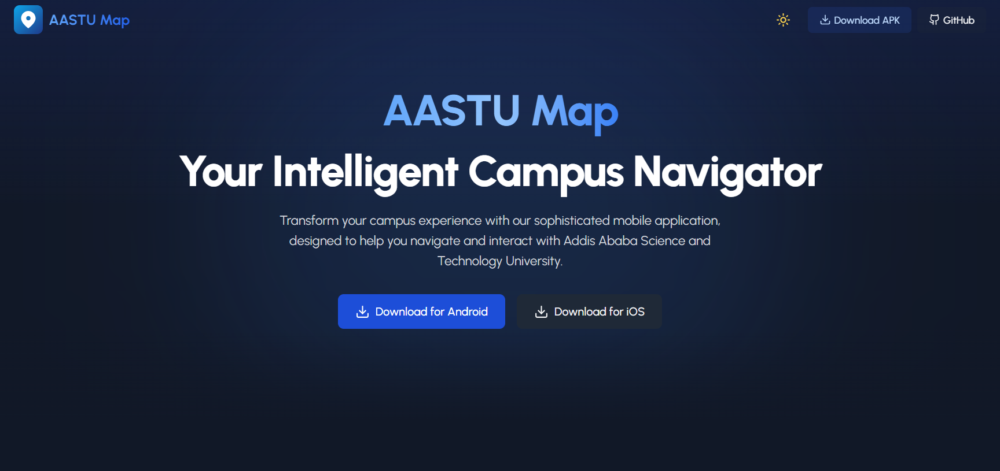

# AASTU Map - Campus Navigation



## Overview

AASTU Map is an intelligent campus navigation application designed for Addis Ababa Science and Technology University students, faculty, and visitors. This repository contains the landing page for the AASTU Map application, built with modern web technologies.

The landing page showcases the app's features, provides download links, and explains how the app transforms campus navigation by helping users find buildings, classrooms, offices, and other important locations quickly and easily.

## Contributors 👥
<div align="center">
  <a href="https://github.com/chisa-dev"></a>
  <a href="https://github.com/DagmMesfin"></a>
  <a href="https://github.com/mihretgold"></a>
  <a href="https://github.com/enkutatash"></a>
  <a href="#"></a>
  <a href="https://github.com/resourceful-nebil"></a>
  <a href="https://github.com/Young19ermi"></a>
  <a href="https://github.com/Fasikagebrehana"></a>
  <a href="https://github.com/natiyeshi"></a>
  <a href="https://github.com/Sefukamil20R"></a>
  <a href="https://github.com/Mihretthe"></a>
</div>

## 🚀 Features

- **Modern Design**: Built with a contemporary UI featuring smooth transitions and animations
- **Responsive Layout**: Optimized for all device sizes from mobile to desktop
- **Dark Mode Support**: Fully implemented light and dark themes
- **Performance Optimized**: Fast loading and rendering for excellent user experience
- **SEO Ready**: Comprehensive metadata for better search engine visibility

## 🛠️ Tech Stack

- **Next.js** - React framework with server-side rendering and static site generation
- **TypeScript** - Type-safe JavaScript for improved developer experience
- **Tailwind CSS** - Utility-first CSS framework for rapid UI development
- **Framer Motion** - Animation library for React
- **Lucide Icons** - Beautiful, consistent icon set
- **Urbanist Font** - Clean, modern typeface for excellent readability

## 🔧 Getting Started

### Prerequisites

- Node.js 16.x or higher
- npm or yarn package manager

### Installation

1. Clone the repository
```bash
git clone https://github.com/yourusername/aastu_map_landing.git
cd aastu_map_landing
```

2. Install dependencies
```bash
npm install
# or
yarn install
```

3. Run the development server
```bash
npm run dev
# or
yarn dev
```

4. Open [http://localhost:3000](http://localhost:3000) in your browser to see the result

## 🚢 Deployment

This site can be deployed in multiple ways:

### Deploy to Firebase Hosting with GitHub Actions

The project is configured for automated deployment to Firebase Hosting using GitHub Actions:

1. Push your code to the main branch of your GitHub repository
2. GitHub Actions will automatically build and deploy to Firebase Hosting
3. Your site will be live at [https://aastu-map-project.web.app](https://aastu-map-project.web.app)

#### Setting up GitHub Actions for Firebase Deployment

1. In your GitHub repository, go to Settings > Secrets and variables > Actions
2. Add a new repository secret named `FIREBASE_SERVICE_ACCOUNT` with your Firebase service account JSON as the value
3. The GitHub Actions workflow is already configured in `.github/workflows/firebase-deploy.yml`

### Manual Firebase Deployment

To manually deploy to Firebase:

1. Make sure you have the Firebase CLI installed:
```bash
npm install -g firebase-tools
```

2. Login to Firebase:
```bash
firebase login
```

3. Build and deploy:
```bash
npm run build
npm run firebase:deploy
```

### Deploy to Vercel

The site can also be deployed to Vercel:

1. Push your code to a GitHub repository
2. Import the project to Vercel
3. Vercel will detect that you're using Next.js and set up the build configuration for you

## 🤝 Contributing

Contributions are welcome! If you'd like to help improve the AASTU Map landing page, please follow these steps:

1. Fork the repository
2. Create a new branch (`git checkout -b feature/amazing-feature`)
3. Make your changes
4. Commit your changes (`git commit -m 'Add some amazing feature'`)
5. Push to the branch (`git push origin feature/amazing-feature`)
6. Open a Pull Request

### Coding Guidelines

- Follow the existing code style and organization
- Write clean, maintainable, and testable code
- Add comments for complex logic
- Update documentation as needed

## 📄 License

This project is licensed under the MIT License - see the LICENSE file for details.

## 👥 Credits

Developed by Google Developers Group on Campus AASTU.

---

Made with ❤️ for Addis Ababa Science and Technology University
